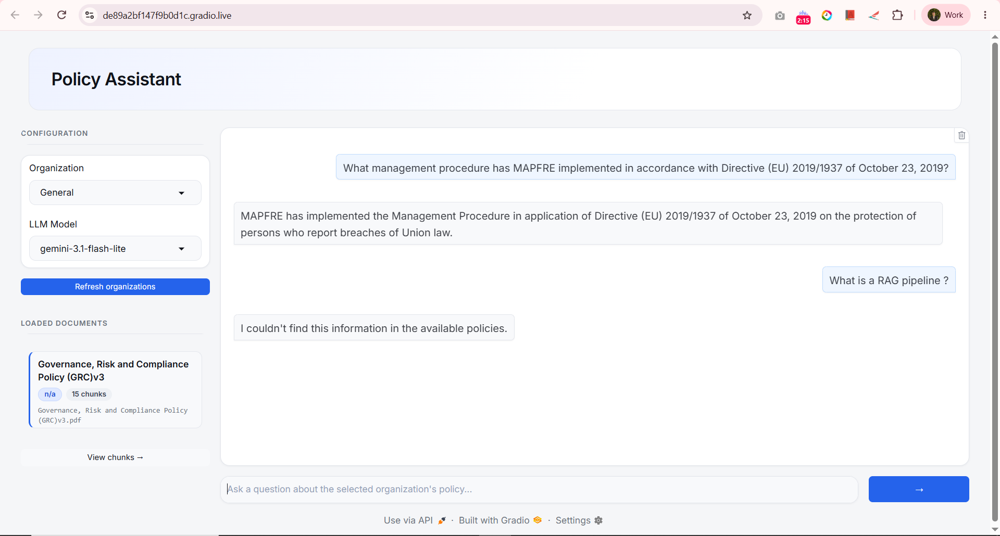
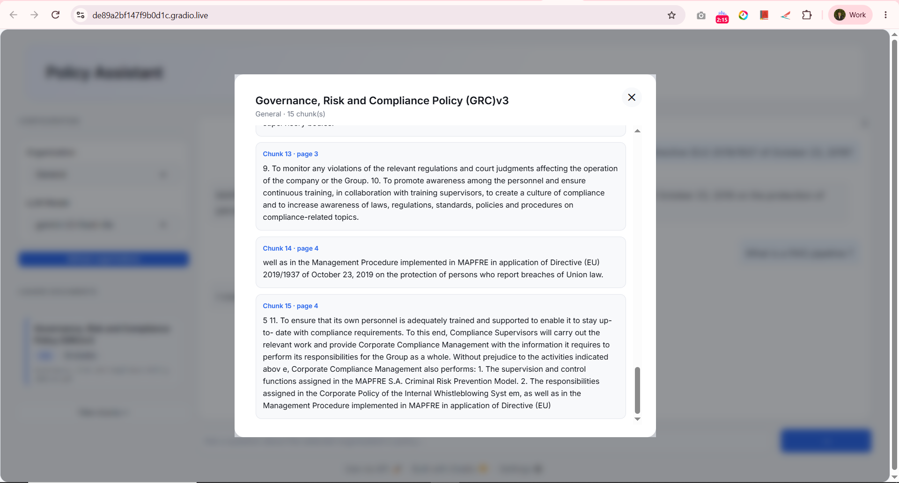

# Policy RAG Chatbot

A multi-organization policy assistant that answers questions **strictly** from indexed policy PDFs — grounded, cited implicitly by source, and honest when the answer isn't in the documents. Built as a notebook-first RAG project: Google Gemini for embeddings/generation, Qdrant Cloud as the persistent vector store, and a Gradio console UI.

**Live Kaggle notebook:** [kaggle.com/code/utsavkatharotiya0712/policy-assistant-rag-chatbot](https://www.kaggle.com/code/utsavkatharotiya0712/policy-assistant-rag-chatbot)

## Screenshots

**Policy Q&A console** — organization/model selection, loaded documents sidebar, chat:

**Chunk viewer modal** — click any loaded document to see its actual stored chunks (the vector-store content that grounds answers):

## What it does

- Ingests policy PDFs, one organization/policy pair at a time, via a simple upload widget (`ipywidgets.FileUpload` — works the same in Kaggle, Colab, or plain Jupyter).
- Auto-parses organization, policy name, and version straight from filenames like `01_technova_Leave_Time_Off_Policy_v1_0.pdf`.
- Chunks and embeds each PDF (Gemini embeddings) into a shared **Qdrant Cloud** collection, tagged with `organization` / `policy_name` / `policy_version` / `source_file` / `page` metadata.
- Retrieval is **filtered by organization** at query time — one company's policies can never leak into another's answer.
- Re-uploading a PDF for the same `(organization, policy_name)` replaces the old version; different policies for the same org (Leave, WFH, Travel, ...) all coexist.
- Answers come from a strict prompt: only the retrieved context is used, and unsupported questions get exactly *"I couldn't find this information in the available policies."*
- A Gradio UI lets you pick an organization + LLM model, chat, and inspect exactly which chunks are stored for any loaded document (via a modal, no page navigation needed).

## Stack

Python · LangChain · Google Gemini (`gemini-embedding-001` for embeddings, Gemini chat models for generation) · Qdrant Cloud (free tier) · Gradio

## Project files

| File | Purpose |
|---|---|
| `RAG_Based_ChatBot.ipynb` | The project notebook — pipeline (PDF → chunks → Qdrant → retrieval → strict RAG) + Gradio UI. |
| `LLM_Fundamentals_Basics.ipynb` | Companion notebook covering the underlying LLM/RAG concepts (frameworks, memory, embeddings, RAG basics) this project builds on. |
| `policy_assistant.css` | Optional cosmetic styling for the Gradio UI (wide layout, button accents). Core layout/modal CSS is embedded in the notebook itself so the UI still looks right if this file isn't uploaded. |
| `Sample Documents/` | 15 sample policy PDFs across 3 fictional organizations (`technova`, `databridge`, `git`) for testing multi-org isolation and version replacement. |
| `Policy_RAG_Chatbot_Project_Plan.pdf` | The original project plan this notebook was scoped against. |

## Running it

1. Open `RAG_Based_ChatBot.ipynb` in Kaggle, Colab, or Jupyter.
2. **Setup**: run the install cell, then provide a **Gemini API key** ([Google AI Studio](https://aistudio.google.com/app/apikey)) and **Qdrant Cloud** credentials (free cluster at [cloud.qdrant.io](https://cloud.qdrant.io) — cluster URL + API key).
3. Run **Section 1** (1.1–1.5) to build the pipeline.
4. Run **Section 1.6** once to upload and index your policy PDFs (e.g. everything in `Sample Documents/`).
5. Run **Section 2** to launch the Gradio console — pick an organization and model, then ask questions.

Optional: upload `policy_assistant.css` alongside the notebook (same working directory) for the extra wide-layout/button styling.

## Scope (V1)

- PDF policies only — one active version per `(organization, policy_name)`.
- Organization and policy metadata are entered manually at upload time (via filename parsing), not auto-detected from document content.
- No conversation history / multi-turn memory — each question is answered independently.

Left for later: automatic policy metadata/version detection, DOCX/TXT/Web ingestion, authentication & roles, conversation history, and an evaluation dashboard.
